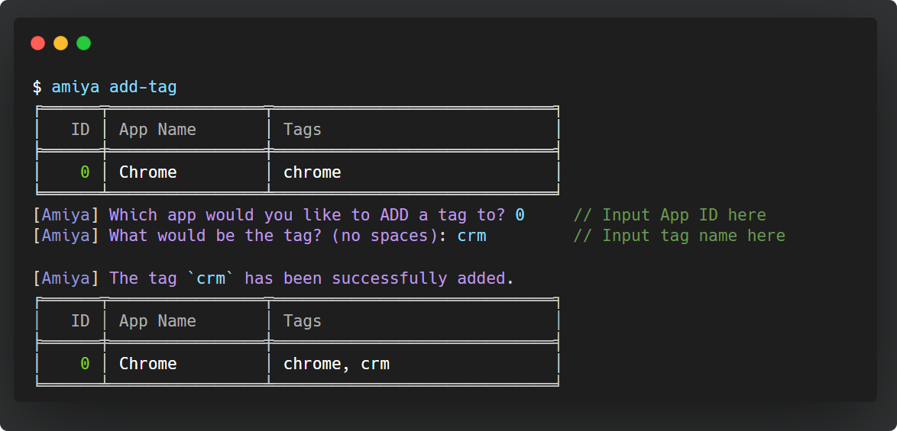

# Amiya (in development)
Amiya - a lightweight cross-platform automation tool that allows scheduled start and automation of any application from the CLI. 

<div align="center">
    <p style="padding-bottom: 0">
        
    </p>
    <!-- <span style="color: #093163">A lightweight cross-platform automation tool for daily tasks!</span> -->
</div>


## Overview
Amiya is a easy-to-use and versatile cross-platform application and game automation tool designed for efficiency and ease of use directly from the CLI. This package offers automation capabilities for any applications (including games), enabling users to start and control any application with simple CLI commands.

<div align="center">
    <p style="padding-bottom: 0">
        
    </p>
    <!-- <span style="color: #093163">A lightweight cross-platform automation tool for daily tasks!</span> -->
</div>


The primary features supported by the `amiya` package are:
1. **Application Launcher**: Start and terminate any applications from the CLI
2. **Automation Controller**: Automate any applications with recorded mouse & keyboard sequences
3. **Scheduling**: Schedule the start/automation of any application to run at any time


Designed to be lightweight and fully CLI-based, Amiya is perfect for users who need a reliable and scalable solution for managing and automating their software applications or games.


## Installation Guide
To install the `amiya` package locally, run:
```bash
$ pip install amiya
```
OR
```bash
$ git clone https://github.com/ReZeroE/Amiya.git
$ cd Amiya/
$ pip install .
```

## How to use

#### 1. Add new application
To start off, an application must be configured with `amiya`'s app manager. To add and configure a new application, run:
```
$ amiya add-app
```
... and then follow the prompted steps in the CLI to add the application.
<!-- ```
$ amiya add-app
[Amiya] New Application's Name: Chrome
[Amiya] New Application's Path: C:/path_to_chrome/chrome.exe
╒════════════╤══════════════════════════════╤════════════╤════════╕
│ App Name   │ Path                         │ Verified   │ Tags   │
╞════════════╪══════════════════════════════╪════════════╪════════╡
│ Chrome     │ C:/path_to_chrome/chrome.exe │ True       │ chrome │
╘════════════╧══════════════════════════════╧════════════╧════════╛
``` -->


Notice in the *Tags* column, a new tag named `chrome` has been auto-generated. When a new application gets added to `amiya`'s apps manager, a default tag will always be generated.

The tag is used to identify the application in all other commands (more on this later).

#### 2. Add tag to application
You may also add a tag to any application by running:
```
$ amiya add-tag
```
... and then follow the propted steps to add a new tag to an application.
<!-- ```
$ amiya add-tag
╒══════╤════════════════╤═════════════════════════════╕
│   ID │ App Name       │ Tags                        │
╞══════╪════════════════╪═════════════════════════════╡
│    0 │ Chrome         │ chrome                      │
╘══════╧════════════════╧═════════════════════════════╛
[Amiya] Which app would you like to ADD a tag to? 0          // Input ID here
[Amiya] What would be the tag? (no spaces): crm              // Input tag name here
╒══════╤════════════════╤═════════════════════════════╕
│   ID │ App Name       │ Tags                        │
╞══════╪════════════════╪═════════════════════════════╡
│    0 │ Chrome         │ chrome, crm                 │
╘══════╧════════════════╧═════════════════════════════╛
[Amiya] The tag `crm` has been successfully added.
``` -->


#### 3. Start the application
You can now start the application by using the new tag (`crm`) you have just added in the previous step:
```
$ amiya start crm
```
This will initialize and then start the application.

**Alternatively**, if you do not remember the tag of the application, you can simply run:
```
$ amiya start
```
... and then follow the prompted steps to select and start the application.


#### List all apps
To list all applications you have added to `amiya`'s app manager, run:
```
$ amiya show-apps
```


